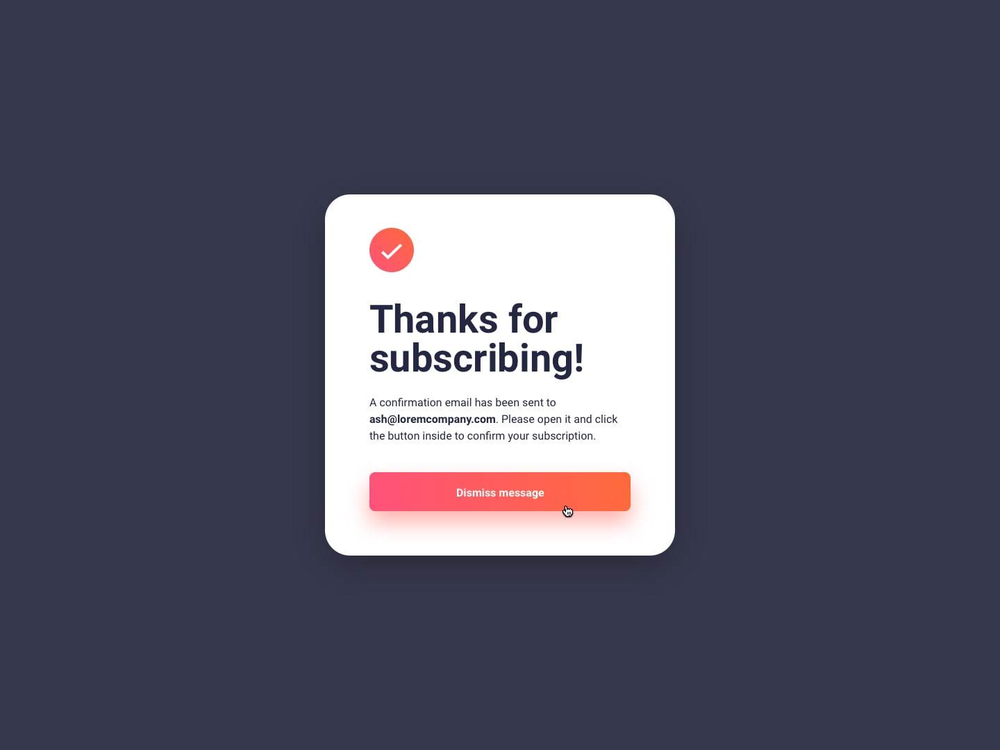

# Newsletter Signup Form

This is a solution for the [Newsletter Signup Form with Success Message challenge](https://www.frontendmentor.io/challenges/newsletter-signup-form-with-success-message-3FC1AZbNrv) on Frontend Mentor.

## Table of Contents

- [Overview](#overview)
    - [Screenshot](#screenshot)
    - [Links](#links)
- [Built With](#built-with)
- [Features](#features)
- [How to Use](#how-to-use)
- [Backend Integration](#backend-integration)
- [Acknowledgements](#acknowledgements)

## Overview

The Newsletter Signup Form project is a frontend challenge that allows users to sign up for a newsletter by providing their email address. Upon successful submission, a success message is displayed.

### Screenshot

### Links

- [Live Demo](https://vaqueraoscar0.github.io/FrontendMentorIO-NewsletterForm)
- [Frontend Mentor Solution Page](https://www.frontendmentor.io/solutions/newsletter-signup-form-react-google-sheets-api-I8-0yYAH0)

## Built With

This project was built using the following technologies:

- React
- HTML5
- CSS3
- Google Script
- Google Sheet API

## Features

This project includes the following features:

- User-friendly form with email validation
- Success message display upon successful submission
- Integration with Google Sheets API for storing email addresses

## How to Use

To use this project, follow these steps:

1. Clone or download the repository to your local machine.
2. Navigate to the project directory and install the dependencies by running `npm install`.
3. Start the development server by running `npm start`.
4. Open the application in your browser at `http://localhost:3000`.

Enter your email address in the provided field and click the submit button to sign up for the newsletter. If the submission is successful, a success message will be displayed.

## Backend Integration

To store the email addresses, this project integrates with the Google Sheets API. Instead of creating a custom backend, Google Scripts are used to handle the POST request and save the email address directly to a Google Sheet.

The integration with Google Sheets API involves configuring credentials, setting up authorization, and making HTTP requests to interact with the Google Sheet. Refer to the [Google Sheets API documentation](https://developers.google.com/sheets/api) for more information on how to set up and use the API.

## Acknowledgements

- [Frontend Mentor](https://www.frontendmentor.io) for providing the challenge
- [Google Sheets API](https://developers.google.com/sheets/api) for integrating with the backend
- [AnatuGreen](https://developers.google.com/sheets/api) https://github.com/AnatuGreen/FormData-to-Google-Sheet
